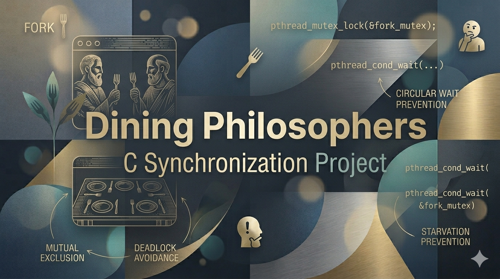
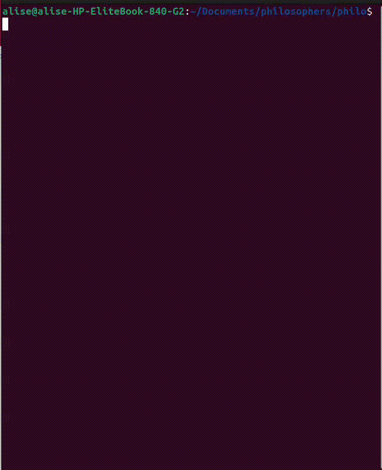
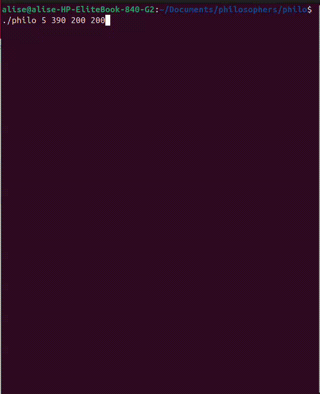
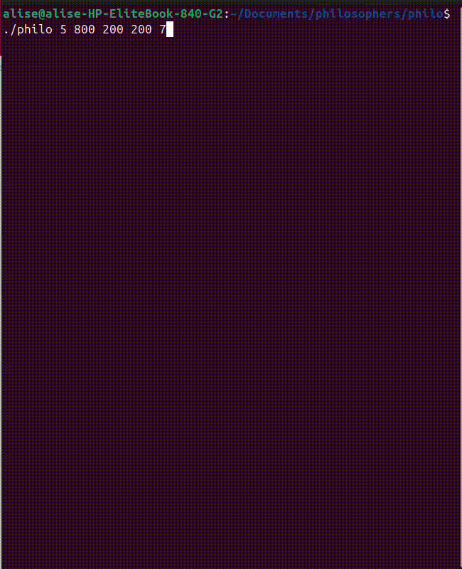

A multithreaded C implementation of the [Dining Philosophers problem](https://en.wikipedia.org/wiki/Dining_philosophers_problem) focused on safe synchronization, timing accuracy, and clean concurrent system design.

## Overview

`Philosophers` is a systems programming project from 42 Berlin that recreates the classic concurrency challenge where multiple threads compete for shared resources.

The project was built to practice:
- Writing thread-safe C code with POSIX threads and mutexes
- Preventing race conditions and deadlocks in resource sharing
- Designing reliable monitoring and shutdown logic for real-time constraints

Achieved score: **100/100**

## Demo / Screenshots

### Argument Validation



### Philosopher Dies



### All Philosophers Finished




## Tech Stack

- **Language:** C
- **Concurrency:** POSIX Threads (`pthread`)
- **Synchronization:** POSIX Mutexes
- **Build:** GNU Make
- **System APIs:** `gettimeofday`, `usleep`
- **Platform:** Linux / Unix

## Architecture / Implementation

The codebase is organized into focused modules with clear responsibilities:

- `main.c`: Program entrypoint, thread lifecycle, simulation flow
- `init.c`: Initialization of shared state, philosophers, forks, and mutexes
- `monitor.c`: Central monitor for death detection and completion conditions
- `utils.c`: Timing helpers, precise sleeping, synchronized logging
- `check.c`: CLI input validation and argument checks
- `destroy.c` + `error_exit.c`: Resource cleanup and failure paths

Key implementation decisions:

- One mutex per fork to protect exclusive ownership
- One mutex per philosopher to guard mutable state (`last_meal`, `finished`)
- A dedicated monitor loop to enforce starvation timing guarantees
- Alternating fork pickup order (odd/even philosophers) to reduce circular wait risk
- A print mutex to keep logs readable and free of interleaving

## Features

- Configurable simulation through command-line arguments
- Optional meal target (`number_of_times_each_philosopher_must_eat`)
- Millisecond-based starvation detection
- Thread-safe, timestamped status output
- Robust argument validation and error handling
- Graceful cleanup of threads, mutexes, and allocated memory

## Getting Started

### 1. Clone the repository

```bash
git clone https://github.com/chilituna/philosophers.git
cd philosophers/philo
```

### 2. Build

```bash
make
```

### 3. Run

```bash
./philo number_of_philosophers time_to_die time_to_eat time_to_sleep [number_of_times_each_philosopher_must_eat]
```

Example:

```bash
./philo 5 800 200 200 5
```

### 4. Clean build files

```bash
make clean
make fclean
```

## Project Structure

```text
philosophers/
├── README.md
├── LICENSE
└── philo/
    ├── Makefile
    ├── includes/
    │   └── philo.h
    └── src/
        ├── main.c
        ├── init.c
        ├── monitor.c
        ├── utils.c
        ├── check.c
        ├── destroy.c
        └── error_exit.c
```

## Future Improvements

- Add CI checks (build + thread sanitizer / helgrind profiles)
- Create a small automated test matrix for edge cases
- Improve scheduling fairness under heavy load
- Add optional log modes (`minimal`, `verbose`, `debug`)
- Include benchmark notes for larger philosopher counts

## What I Learned

- Practical multithreading patterns in C using `pthread`
- Mutex strategy design for shared-state consistency
- Debugging timing-sensitive concurrency issues
- Structuring low-level projects for maintainability
- Building deterministic shutdown logic in concurrent programs

## License

This project is licensed under the MIT License. See [LICENSE](LICENSE) for details.
